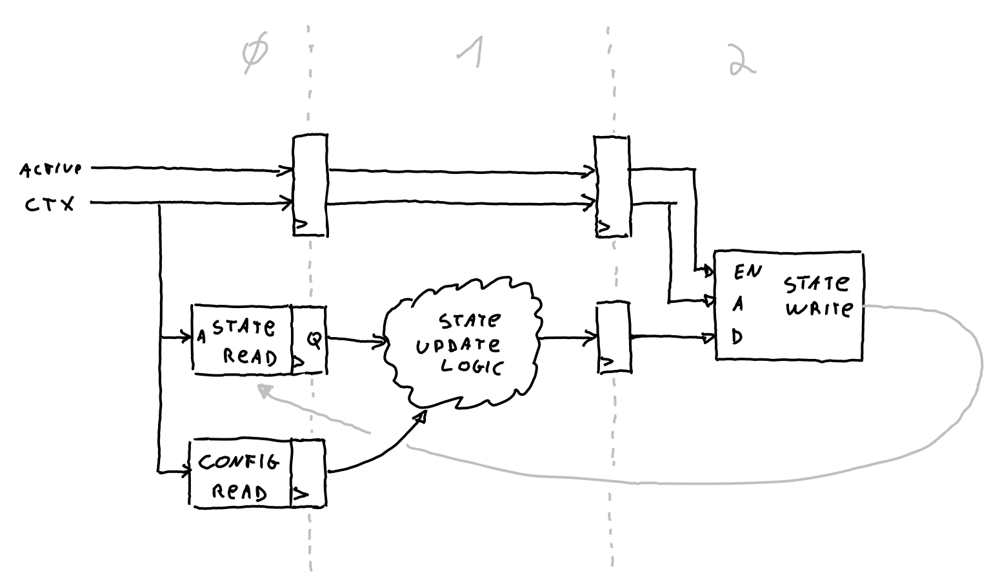
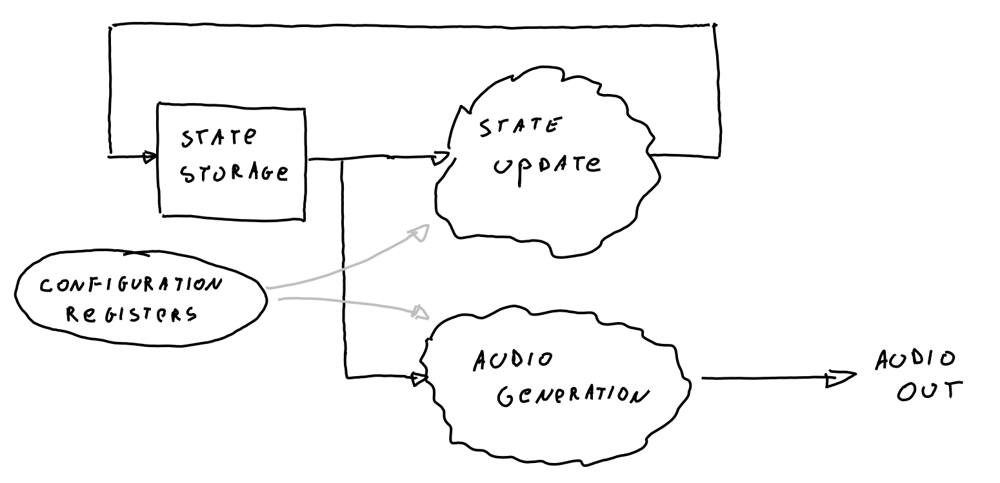

Synthesizer core
================

Address map
-----------

### Global registers

**TODO**

### Voice registers

**TODO**

Implementation
--------------

### Introduction

The implementation of this blocks tries to make use of the resources available
in the ECP5 FPGA as much as possible.

To achieve this, it uses both pipelining and time-sharing/multiplexing.

#### Pipelining

Pipelining is a very common technique in FPGA programming and you can read
about it in details [here](https://www.allaboutcircuits.com/technical-articles/why-how-pipelining-in-fpga/).

The general idea is to subdivide the function to compute into sub-functions,
each one using the result of the previous one, then inserting registers
between them (the so called "pipeline registers").
That allows to increase the maximum frequency (because the combinatorial delay
between two registers is reduced) and increase the throughput (because you can
still feed a new data at each clock cycle).

Now, because it's important to properly keep track of every pipeline level and
not mix data/control across them, the code uses a coding convention of using
a suffix `_0`, `_1`, ..., `_n` to keep track of what pipelining level a signal
belongs to. So for instance `active_0` represents if we're currently processing
valid data in pipelining stage 0. And `active_1` represents the same thing but
in pipelining stage 1.

Time-sharing or time-multiplexing is used to reduce the logic usage. In this
context, we have 16 voices but they're running at a sample rate of 48 KHz, but
out FPGA logic is actually running at 48 MHz, so about 1000 times faster.

So instead of having all the logic for the voices duplicated 16 times in the
FPGA, we can instead process each voice one after the other over 16 cycles and
it still leaves us 984 cycles where the logic is idle.

To keep track of where we are in this 'cycle', we internally use a few signals
to know the current context of execution:

* `ctx`: The current context (i.e. voice) being processed
* `first`: Is this the first voice ?
* `last`: Is this the last voice ?
* `active`: Is this an active cycle ?

And then of course, since this is combined with pipelining, we find versions of
theses signals at different pipelining level. So for instance while pipelining
level 2 could be operating on voice 5, pipelining level 3 could be operating on
voice 4. That's why it's important of keeping track of what is currently being
processed where !

#### Tracking Voice State

Each voice need to keep some state informations (what those are and how they're
used to generate audio will be described later). Usually information would be
stored in registers, but since we have 16 concurrent voices, instead of using
a set of register for each voice and having to mux between them, we use a
special feature of the ECP5.

Each logic slice can be used as a small memory / RAM. This is called
distributed-RAM. It's really small, can store only 16 different words, but
this is perfect for a 16-voice system (kind of why we picked 16 voices ...).

The update of those state variables is explained in the diagram below :

Because of time multiplexing, each state variable is only used once every
16 cycles _at_ most. In practice it's actually used once every 1000 cycles.

This means that the process of updating the state variable can be pipelined
and the added latency will have no effect.

So at pipeline stage 0, we just fetch both the current state value along
with all the configuration for that voice. In the pipeline stage 1, we
update the state, computing the next state value from the current one and
the current config we fetched. And finally in pipeline stage 2, we write
the updated state value back into RAM. And the cycle will repeat every
1000 cycles.

The implementation of those 'multi-context' registers is wrapped in the
`synth_reg` module.

#### Voice Configuration

Each voice also has a bunch of configuration registers (pitch / volume / ...)
and those also need to be stored, just like state variable. The only difference
is that those are not updated by the synthesizer core itself, but by the
user, by performing register writes.

To make things a bit clearer, the implementation of each config register
is also encapsulated in a `synth_cfg_reg` module. Those have a read port
so the synthesizer can fetch the voice config at pipelining stage 0, and
a specific write port that interfaces with the bus interface from the SoC.

### Synthesizer

Below is the general overview of the synthesizer module :

Each voice has a set of state variable that get updated at each sample based
on the voice configuration. Then from the current state of the voice, one
audio sample will be produced by an "Audio generation" path.

Note that in the following explanations, the "multi-context" aspect is not
represented to make the diagram easier to read and so they're drawn like
if there was only 1 voice. But keep in mind that any register drawn on
there that represent a state variable for the voice is actually a `synth_reg`
being updated in a pipelined process as explained above.

The "Audio Generation" path is also a pipelined process that takes several
cycles to compute 1 output sample and also an interleaved process that
process all 16 voices sequentially. But because there is no "state" stored
between sample in that path, the registers are just simple registers.

#### State: Phase accumulator

This is the basis for audio generation: generating a periodic waveform. To
do this, we use a simple accumulator that wraps around and the rate at which
it wraps around is controlled by how much we increment it at each sample,
the so called `phase_inc` configuration register.

We also have a special bit allowing to force the accumulator to 0 if you
wand to foce phase synchronization between voices.

#### State: Volume Envelope

The envelope is the current volume of the voice when its active. They
don't just go from 0 to 100% volume instantly, instead, once turned on,
they progressively rise in volume (called _attack_) until they reach
max volume where they stay until they're turned off and they progressively
go down (_decay_) until zero.

The state transition diagram is pretty straight forward with just a few special "shortcuts" when a note changes
state during the _attack_ or _decay_ phase.

The _attack_ and _decay_ phase use exponential rise and decay functions, that
are approximated by the following logic :

The underlying math properties of exponentials that allows them to
be approximated that way are a bit out of scope for this document. But
if you insist, you can get a clue from slide 7 of [this document](https://archive.fosdem.org/2015/schedule/event/rfnocfosphor/attachments/slides/804/export/events/attachments/rfnocfosphor/slides/804/fosdem2015_rfnoc_fosphor.pdf).

And finally the global update process for the envlope volume uses this
computed exponential value to update the envelope volume state variable
if needed.

If the voice is in the `OFF` state, its volume is forced to zero, if it is
in the `ATTACK` or `DECAY` state, the exponential is applied and if it's in
`SUSTAIN`, the volume is not update at all (and remains maximum).

A little details of the process is that a configuration variable allows to
slow down the volume transition by only updating it every N samples, this allows
to make the attack and decay phases longer. Combine this with the ability to
tweak the exponential "time-constant" and this gives fairly good control over
the envelope.

#### Audio generation

The first step of audio generation is mapping the current phase value (which
represent the current position in the 'cycle') to a sample value.

This is either done using a fixed function that creates one of four types of
waveforms :

Alternatively the phase value can be used as address to lookup a value into
a RAM (Wavetable) to create custom waveforms.
